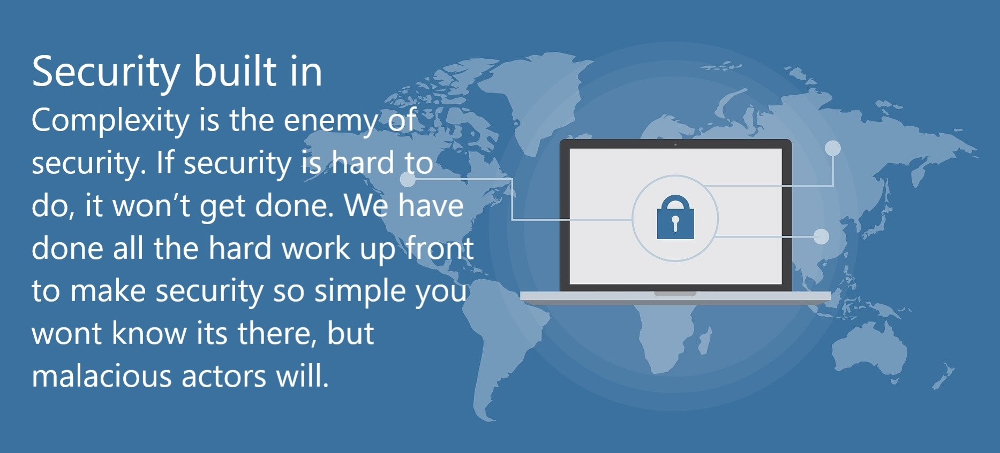

#### An best practice opinionated SBC.

ConnexCS is the first switch to make the help make the important decisions with you.

There is a plethora of complexity when it comes to VoIP Communications and some times getting things done seems to be a higher priority than doing things right. But with Round Edge SBC we let you do both of those at the same time and we make it more difficult to do things wrong. Some examples of this are:

- Number Normalisation
- Fraud Detection
- NAT Handeling
- Audit & Change Rollback
- DoS Protection
- Security Built-in

## Normalization
How do you write a phone number, does it start with a 0, a + or a 00 or the country code. We make sure that this is automatically handled for you. What about P-A-ID, are you dealing with that correctly, is it in the right format. With us it is and you don't need to think about it.

## Fraud Detection
Scammers can be very smart, there are many attack vectors to exploit your platform. But scammers are also predictable, targeting premium rate numbers, dialing at night when no one is watching. Simply having an SBC which has fraud detection is not enough, unless you spend a great deal of time learning what are high risk numbers world wide it will be ineffective. We have done that work for you. So you are protected against the most common threats out of the box. But if you have more to add, you have the flexibility to do so.

## NAT Handeling
Ever had 1 way audio problems, or a customer's NAT is being alkward. We do Far-End-NAT-Traversal, we basically look at whatever has been sent and inteligentally detect what it should be, then fix it on the recieving end meaning your customer does not have to make things work, it just works automagically.

## Audit & Change Rollback
Its out of hours and a customer ask for an important change, you make it and poof things stopped working. You knew 5 minutes ago it was working fine, but how do you get back to a working state. With Snapshot and Revert any change that you can be rolled back to the last good known configuration and you need not panic.

## Denial of Service Protection
If your network gets targeted you want to quickly nullify all the attackers traffic, if you need a human to do this, your have already lost packets. We detect and stop even the scouting traffic as well as do everything that can be done above the network layer to reduce processing any harmful packets.

## Security built in
Complexity is the enemy of security. If security is hard to do, it won't get done. We have done all the hard work up front to make security so simple you wont know its there, but malacious actors will.

{:.lead width="192" height="108" loading="lazy"}
